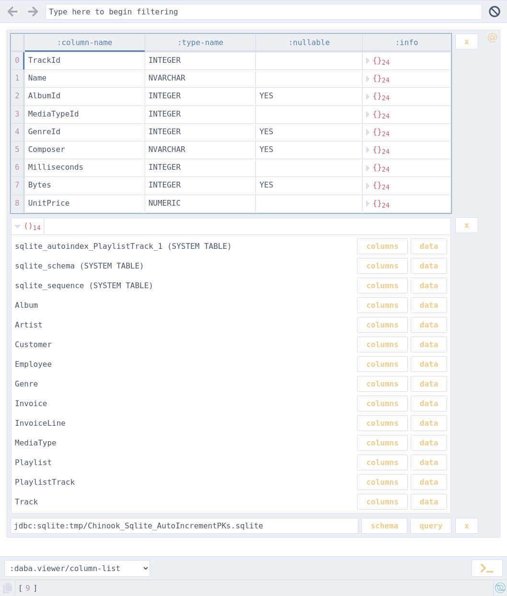
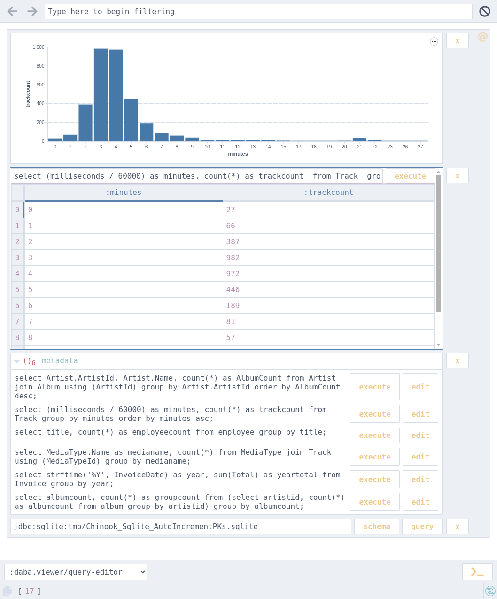

# Daba Database Client

Daba is a graphical database client built on top of [Portal](https://github.com/djblue/portal).

It aims to combine some of the convenience of traditional GUI clients with the extensibility and power of [REPL](https://clojure.org/guides/repl/introduction)-based workflows.
Start with initial exploration of database schema and data visually, then manipulate results further programmatically via REPL.

| Explore schema | Query and visualize |
| - | - |
|  |  |

## Getting Started

#### Use without installing

```
clojure -Sdeps '{:deps{io.github.dundalek/daba{:git/tag"v0.1.0":git/sha"f2c76ca"}}}' \
        -X daba.api/open
```

<!--
```
clojure -Sdeps '{:deps{io.github.dundalek/daba{:mvn/version"0.1.0"}}}' -X daba.api/open 
```

```
clojure -Sdeps '{:deps{io.github.dundalek/daba-cli{:mvn/version"0.1.0"}}}' -X daba.api/open 
```
-->

#### Install as tool

```
clojure -Ttools install io.github.dundalek/daba '{:git/tag"v0.1.0"}' :as daba
```

<!--
```
clojure -Ttools install-latest :lib io.github.dundalek/daba :as daba
```

Getting error: "Namespace clojure.tools.tools.api loaded but function not found: install-latest"

would it be possible to omit `:as`?
```
clojure -Ttools install-latest :lib io.github.dundalek/daba
```
-->

Then run:

```
clojure -Tdaba open
````

#### Install by adding alias

`~/.clojure/deps.edn` to `:aliases` section

```clojure
{:aliases
 {:daba
  {:extra-deps {io.github.dundalek/daba {:git/tag "v0.1.0" :git/sha "f2c76ca"}}
   :exec-fn daba.api/open}}}
```

Then run:
```
clojure -Xdaba
```

Using this way one can also include additional JDBC drivers.

## Features

- Connect
  - Connect to datasource
    - Use URI string or db-spec map
  - Use Datasource Input viewer for string or map
- Explore
  - List databases for datasource
  - List tables for database
  - List columns for table
  - Data grid with pagination for table data
- Query
  - Execute SQL query
  - Use Query Editor viewer for string
- Other
  - Remove individual cards using X button
    - Useful for rapid exploration of tables
  - Get results as value in REPL by dereferencing Portal instance
  - Visualize data using Portal's builtin `vega-lite` viewer
  - Portal filtering works when selecting list of schemas, tables, columns

## Supported Databases

- PostgreSQL
- SQLite
- DuckDB
- H2

And likely other databases that provide a JDBC driver.

## API

See [API.md](doc/API.md) and [example/user.clj](example/user.clj) which includes examples using the API from REPL.
