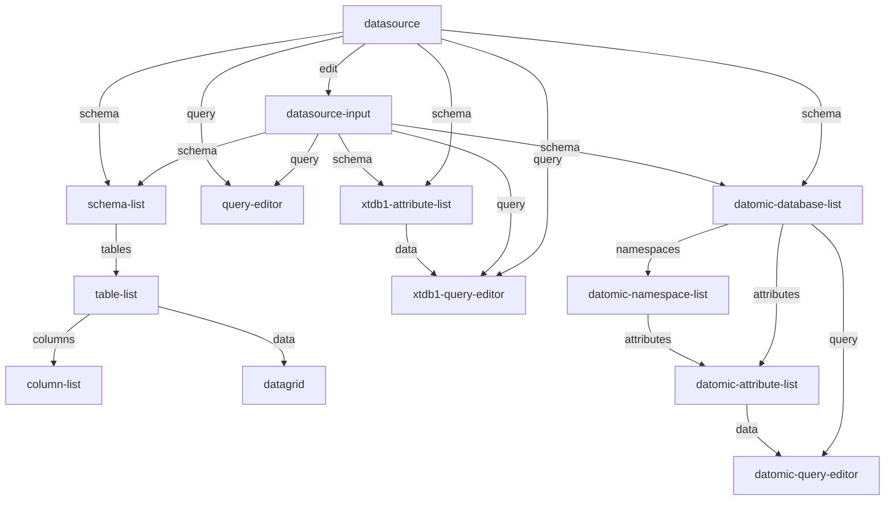

## User Flow

```mermaid
flowchart TB
  datasource -- edit --> datasource-input
  datasource-input -- schema --> schema-list
  datasource-input -- query --> query-editor
  datasource -- schema --> schema-list
  datasource -- query --> query-editor
  schema-list -- tables --> table-list
  table-list -- columns --> column-list
  table-list -- data --> datagrid

  datasource -- schema --> xtdb1-attribute-list
  datasource-input -- schema --> xtdb1-attribute-list
  datasource -- query --> xtdb1-query-editor
  datasource-input -- query --> xtdb1-query-editor
  xtdb1-attribute-list -- data --> xtdb1-query-editor

  datasource -- schema --> datomic-database-list
  datasource-input -- schema --> datomic-database-list
  datomic-database-list -- namespaces --> datomic-namespace-list
  datomic-database-list -- attributes --> datomic-attribute-list
  datomic-database-list -- query --> datomic-query-editor
  datomic-attribute-list -- data --> datomic-query-editor
  datomic-namespace-list -- attributes --> datomic-attribute-list
```
